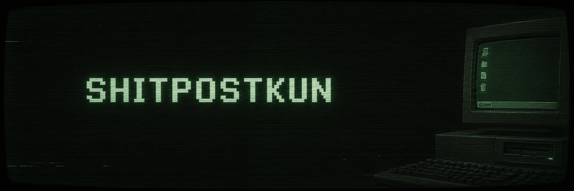

  

 

<picture>
  <source
    media="(prefers-color-scheme: dark)"
    srcset="https://readme-typing-svg.demolab.com?font=Courier+Prime&size=18&duration=3000&pause=1000&color=00FF66&center=true&vCenter=true&width=600&lines=developer+%E2%80%A2+designer+%E2%80%A2+music+%E2%80%A2+games;welcome+to+SHITPOSTKUN;building+things+on+the+internet"
  />

  <source
    media="(prefers-color-scheme: light)"
    srcset="https://readme-typing-svg.demolab.com?font=Courier+Prime&size=18&duration=3000&pause=1000&color=111111&center=true&vCenter=true&width=600&lines=developer+%E2%80%A2+designer+%E2%80%A2+music+%E2%80%A2+games;welcome+to+SHITPOSTKUN;building+things+on+the+internet"
  />

  
</picture>

  

  

  

